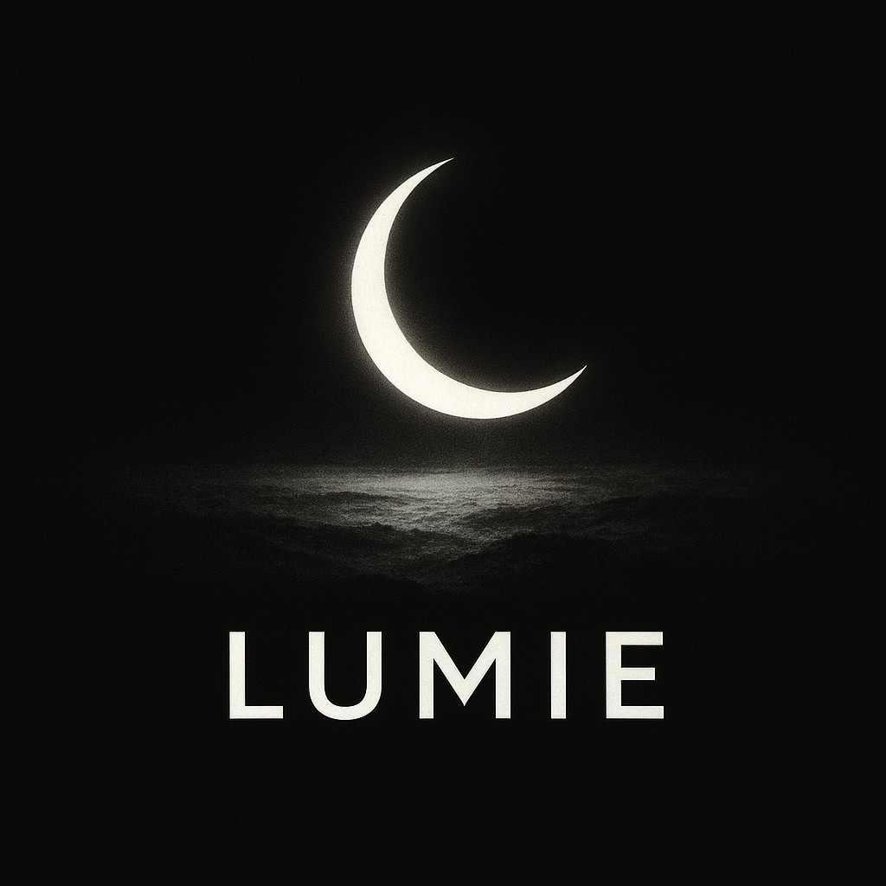

# SUNIE - 産業向けAI-WEBアプリケーション(Scholar & Professor)

## 本件アプリの設計思想＆設計哲学
ここで、思考や感情は心や意識から生まれます。  
では、心や意識とは何でしょうか・・・？。  
私が考えるに、心は意識の中にこそあり、  
心は刺激によって駆動する「意識のエンジン」です。  
すなわち、刺激を受けて心が働き、感情が生じる・・・。  
次いで、この感情を処理するために思考が働く・・・。  
そして、思考が働くから、判断や行動が可能になる。

## 本件アプリの設計案(LUMIE-Architecture)
本件アプリは、ルールベースとニューラルネットを混成したハイブリッドAIを目指します。  
ユーザーからのメッセージをニューラルネット(LLM)が、その意図を抽出して、後続のルールベースに引き継ぎます。  
ルールベースは、その高い論理性を活かして正確にユーザー要求(タスク)を処理します。  
そして、その結果をニューラルネットが自然言語の応答メッセージにして出力します。

## もっとも強調・アピールしたい点

## 最終的な目標

## 開発状況をチェックして下さっている方々へ

## 各ファイル＆各フォルダーについての説明

## 管理者用初期パスワード

## ライセンス＆免責事項
これらのコードはMITライセンスのもとで公開されています。詳しくは「LISENCE」ファイルを参照してください。

- 改変: 可
- 再利用: 可
- 再頒布: 可

コードファイルに記載された内容は、情報提供のみを目的としています。
したがって、コードを参考にした運用は必ずご自身の責任と判断において行ってください。
コードの内容については、できる限り正確を期していますが、コードの内容に基づく運用結果について、作者は一切の責任を負いかねます。
あらかじめご了承ください。

## 製作・開発者
森下哲博(moriaki1983)

## 連絡先
moriaki1983@outlook.jp
